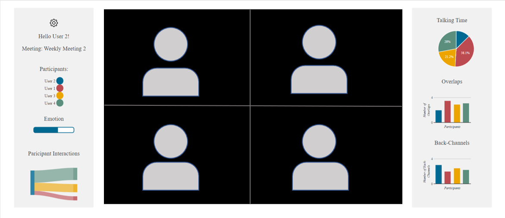

# GUI to Improve Online Group Meetings
> Jan - Jul 2022

A real-time human behavior monitoring system with a feedback mechanism was proposed to reach the goal of monitoring and recognizing aspects of human behavior which could be negatively impacting the quality of social interactions.  

This program displays a visual feedback mechanism through a graphic user interface by displaying information related to nonverbal communication patterns to increase social awareness as seen below 

 

